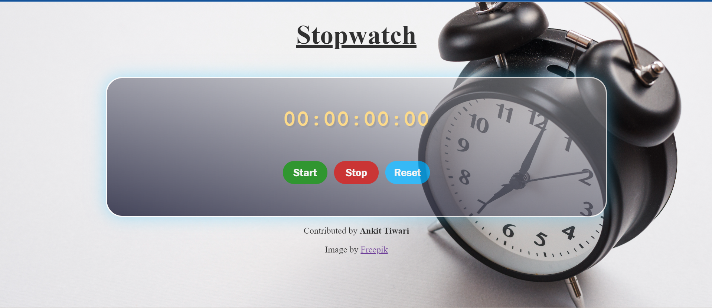

# Frontend Stopwatch Application

---

## Introduction
Welcome to the Frontend Stopwatch Application! This application is designed to serve as a learning project for students and beginners who are interested in building frontend applications using HTML, CSS, and Vanilla JavaScript. With a sleek and responsive user interface, this stopwatch is not only functional but also visually appealing.

**App Look - Desktop View**

## Technologies Used
- HTML5
- CSS3 (Along with Media Queries)
- Vanilla JavaScript

## Additional Resources
- Images and favicon: <a href="freepik.com" target = "_blank">Freepik</a>

## Features
1. **Start Timer:** Begin recording the duration of any task with a simple click.
2. **Pause/Stop Timer:** Pause or stop the timer at any point to resume later or record the final duration.
3. **Reset Timer:** Reset the timer to the default value of "00:00:00:00".

## Implementation Details
The functionality of this stopwatch application is achieved through the following key functions implemented in the JavaScript file:
- `start()`: Initiates the timer.
- `stop()`: Pauses or stops the timer.
- `reset()`: Resets the timer to its default value.
- `render()`: Renders the timer display.

## Usage
1. Clone the repository to your local machine.
2. Open the `index.html` file in your preferred web browser.
3. Use the provided buttons on UI to control the stopwatch:
   - Click "Start" to begin timing.
   - Click "Stop" to pause or stop the timer.
   - Click "Reset" to reset the timer to its default value.

## Contributions
Contributions to this project are welcome! If you have any suggestions, improvements, or feature requests, feel free to open an issue or submit a pull request.

## Acknowledgments

Special thanks to <a href="https://www.codingninjas.com/" target = "_blank">Coding Ninjas</a> for guiding and supporting in completion of this project.

## Contact
For any inquiries or feedback, please contact the project owner - AnkitTiwari10197 at ankittiwariiit@gmail.com.
